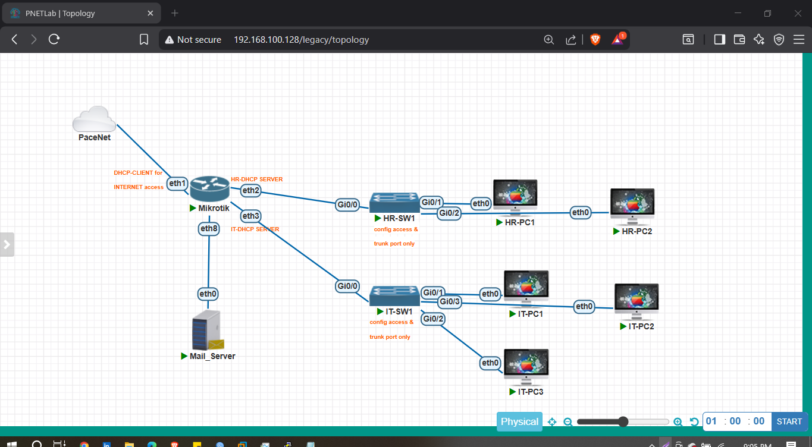

# Enterprise Departmental Network with Core MikroTik Gateway

## Overview
This project demonstrates the design and implementation of an enterprise-style network topology where a MikroTik router operates as both the core and edge gateway. The network provides secure internet access, segmented departmental networks, and controlled internal service connectivity.

The lab was implemented to simulate real-world enterprise network operations and validate routing, NAT, firewall rules, and service reachability using MikroTik RouterOS.

## Network Objectives
- Design segmented departmental networks
- Implement DHCP-based IP addressing
- Enable internet access using Source NAT (Masquerade)
- Configure inter-subnet routing
- Control access to internal services
- Simulate enterprise troubleshooting workflows

## Network Topology
Departments implemented:
- HR Department Network
- IT Department Network

Core Device:
- MikroTik Router (Core & Edge Gateway)

Internal Service:
- Mail Server

The MikroTik router performs routing, NAT, and firewall filtering between networks and external internet connectivity.

## Technologies Used
- MikroTik RouterOS
- IPv4 Addressing
- DHCP Server
- Source NAT (Masquerade)
- Firewall Filtering
- Inter-VLAN / Inter-Subnet Routing
- Network Segmentation

## Network Architecture
HR Network → MikroTik Core Router → Internet  
IT Network → MikroTik Core Router → Internet  
Mail Server → Accessible via controlled routing

## Key Configurations
- Departmental network segmentation
- DHCP server configuration for each subnet
- Source NAT masquerade for internet access
- Static routing between subnets
- Firewall filtering for service control

## Verification and Testing
The following tests were performed:

- End devices successfully obtained IP addresses via DHCP
- HR and IT networks accessed the internet through NAT
- Inter-subnet routing allowed access to the internal Mail Server
- Firewall rules validated controlled communication
- Connectivity and routing behavior verified through ping and service testing

## Skills Demonstrated
- Enterprise network design
- MikroTik routing and NAT configuration
- Network segmentation
- Internal service access control
- Troubleshooting and verification techniques

## Lab Environment
This project was implemented in a virtual lab environment using network simulation tools.

## Author
Sawjon Barikder  
Network & Cloud Security Engineer
